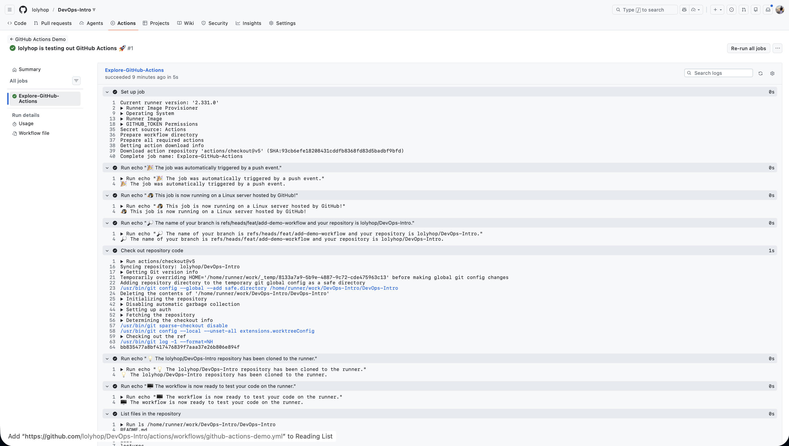
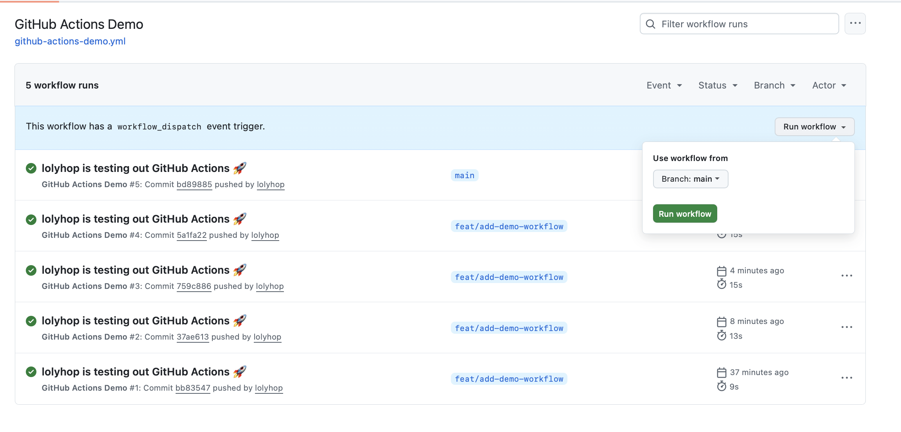
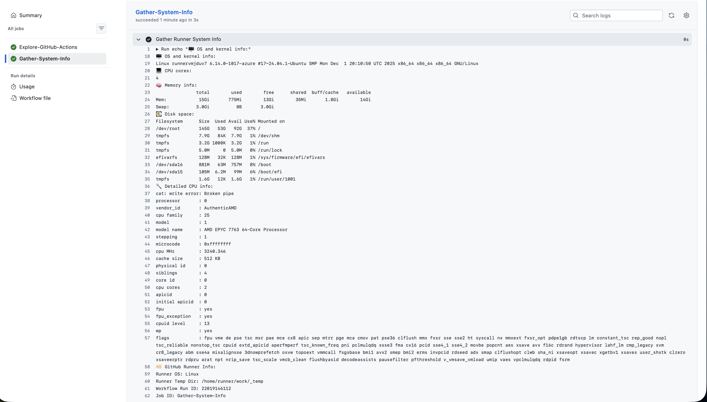

# Task 1

## 1. Workflow Creation

I created the workflow file `github-actions-demo.yml` in the `.github/workflows` directory.

File content:
```
name: GitHub Actions Demo
run-name: ${{ github.actor }} is testing out GitHub Actions 🚀
on: [push]
jobs:
  Explore-GitHub-Actions:
    runs-on: ubuntu-latest
    steps:
      - run: echo "🎉 The job was automatically triggered by a ${{ github.event_name }} event."
      - run: echo "🐧 This job is now running on a ${{ runner.os }} server hosted by GitHub!"
      - run: echo "🔎 The name of your branch is ${{ github.ref }} and your repository is ${{ github.repository }}."
      - name: Check out repository code
        uses: actions/checkout@v5
      - run: echo "💡 The ${{ github.repository }} repository has been cloned to the runner."
      - run: echo "🖥️ The workflow is now ready to test your code on the runner."
      - name: List files in the repository
        run: |
          ls ${{ github.workspace }}
      - run: echo "🍏 This job's status is ${{ job.status }}."
```

The workflow is set to trigger on push and contains a single job Explore-GitHub-Actions that runs on ubuntu-latest. It executes several simple commands to demonstrate runner information and repository status.


## 2. Workflow Execution

I pushed a commit to trigger the workflow. GitHub automatically ran the workflow because the on: [push] event was defined in the YAML file.

**Workflow run screenshot:**




## 3. Observations
- The workflow started automatically when I pushed the commit;
- Steps executed sequentially within a single job;
- Runner information (OS, workspace path) was printed using predefined GitHub contexts like `${{ runner.os }}` and `${{ github.workspace }}`;
- Listing files in the workspace showed all repository contents available on the runner.
- Job status was reported at the end using `${{ job.status }}`.


## 4. Key Concepts Learned
- **Jobs:** Units of work in a workflow. Here, Explore-GitHub-Actions is one job;
- **Steps:** Commands or actions executed inside a job;
- **Runners:** Virtual machines or pods provided by GitHub to run jobs;
- **Triggers:** Events that start workflows (push in this workflow).
- **Contexts:** Variables like `${{ github.actor }}` and `${{ runner.os }}` provide runtime information.


# Task 2

## 1. Manual Trigger Setup

I extended the `github-actions-demo.yml` workflow to include a manual trigger using the `workflow_dispatch` event.

```
on:
  push:
  workflow_dispatch: {}
```

This allows the workflow to be started manually from the GitHub UI without pushing a commit.

Manual trigger screenshot:



## 2. Manual Workflow Execution

I navigated to Actions -> GitHub Actions Demo -> Run workflow, selected the branch, and clicked Run workflow.
- The `Explore-GitHub-Actions` job ran immediately;
- The workflow printed the same basic runner and repository information as during the automatic push trigger.


## 3. Gathering System Information

I added a second job `Gather-System-Info` that runs after `Explore-GitHub-Actions` to collect detailed runner information:

```
jobs:
  Explore-GitHub-Actions:
    ...
  Gather-System-Info:
    runs-on: ubuntu-latest
    needs: Explore-GitHub-Actions
    steps:
      - name: Gather Runner System Info
        run: |
          echo "🖥️ OS and kernel info:"
          uname -a
          echo "💻 CPU cores:"
          nproc
          echo "🧠 Memory info:"
          free -h
          echo "💽 Disk space:"
          df -h
          echo "🔧 Detailed CPU info:"
          cat /proc/cpuinfo | head -n 20
          echo "🏷️ GitHub Runner Info:"
          echo "Runner OS: ${{ runner.os }}"
          echo "Runner Temp Dir: ${{ runner.temp }}"
          echo "Workflow Run ID: ${{ github.run_id }}"
          echo "Job ID: ${{ github.job }}"
```

System info output screenshot:



## 4. Observations
- **Manual vs Automatic Trigger:**
    - Automatic trigger runs immediately after a push.
	- Manual trigger requires user action via GitHub UI but runs the exact same workflow logic.
- **System Information Collected:**
	1. OS and kernel details (`uname -a`)
	2. CPU cores (`nproc`)
	3. Memory usage (f`ree -h`)
	4. Disk space (`df -h`)
	5. Partial CPU info (c`at /proc/cpuinfo`)
	6. GitHub runner metadata (`runner.os`, `runner.temp`, `github.run_id`, `github.job`)
- The manual trigger successfully executed all jobs and printed runner information to the logs.


## 5. Key Concepts Learned
- **workflow_dispatch:** Allows workflows to be manually started from GitHub UI;
- **Job Dependencies:** ensures that Gather-System-Info runs only after Explore-GitHub-Actions;
- **System Info in CI:** Jobs can inspect runner OS, hardware, and GitHub-provided environment variables for diagnostics or pipeline decision-making (specific values are shown in the screenshot above);
- **Consistency:** Both manual and automatic triggers execute the same job steps, making CI pipelines predictable regardless of trigger type.
